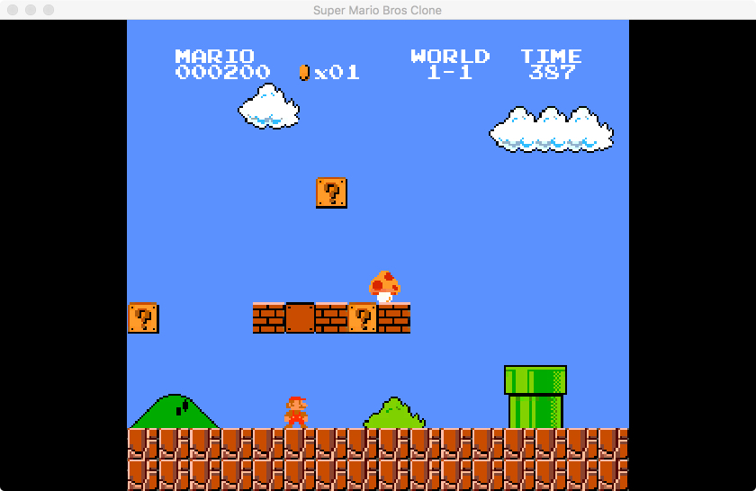
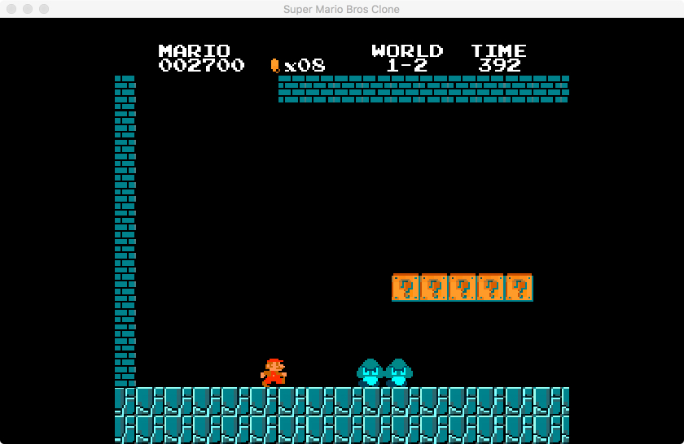
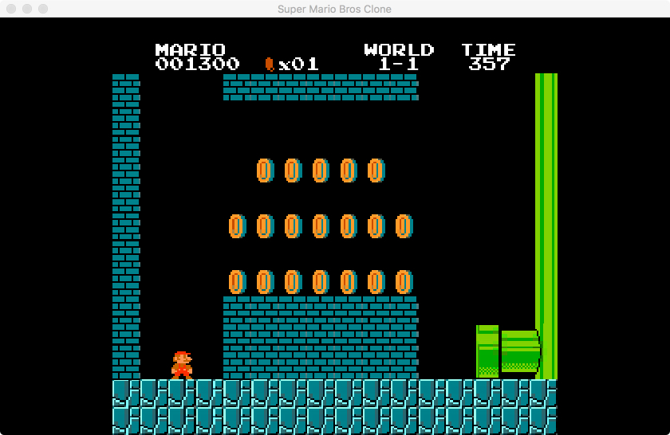
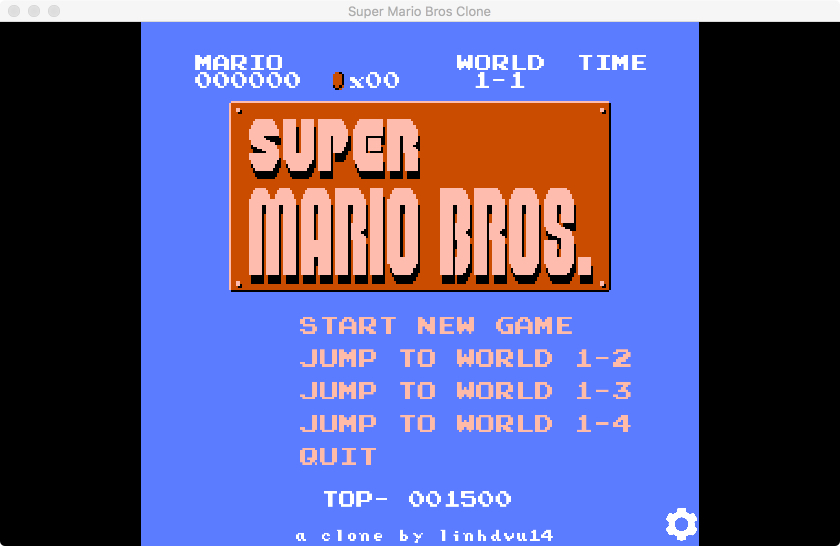

# clover-project-super-mario

用 [Clover 客户端引擎](https://github.com/qw576483/clover-client-unity-engine) **1:1 复刻《超级马里奥兄弟》**（Super Mario Bros.，NES）的项目工程。

**复刻范围**：World **1-1 / 1-2** 原版级还原，含 1-2 → 1-1 的秘密金币房通道；照原版做，不加不减。

| World 1-1 | World 1-2 |
|---|---|
|  |  |

| 地下关 | 主菜单 |
|---|---|
|  |  |

> 上图为**对照基线图**（原版画面，放在 `策划/基线图/`，用于逐格比对）。
> 本工程的验收取证截图是**一次性产物**，验收完即删（见 `策划/验收表.md` 顶部说明），故不随仓库保存。

## 目录结构

| 路径 | 内容 |
|---|---|
| `client/` | Unity 工程（复刻本体；`Library/` `Temp/` `Logs/` 等生成物不入库） |
| `策划/` | `策划案/SuperMarioBros参考规格.md`（复刻规格）、`对照表.md`、`验收表.md`、`基线图/`（原版对照截图） |
| `tools/` | 判据与工具：`verify.ps1`（交付闸门）、`visual-diff.py`（画面差异比对）、`check-assets.ps1`、`probes/`（Unity 探针与量法脚本）、`ai-skill/`（本工程专用 skill 片段） |
| `docs/` | 任务书（`任务书-1-1与1-2原版级.md`、`任务书-12-10-1-2秘密金币房.md`） |

## 判据资产（`tools/`）

| 文件 | 作用 |
|---|---|
| `verify.ps1` | 交付闸门：一次性跑全部判据 |
| `visual-diff.py` | 把实机截图与 `策划/基线图/` 的原版图做像素级比对 |
| `check-assets.ps1` | 资源完整性检查 |
| `probes/` | Unity 侧探针：24 个场景驱动（`boot / menu / intro / crouch / goomba / pause / flag / gameover / level12 / coinroom / koopa / piranha / platform …`）+ HUD 测量、字体预测、标题版权校验等脚本 |

## 怎么跑

1. Unity **6000.x** 打开 `client/`；
2. `cd` 进 `client/` 后按 `策划/验收表.md`「驱动环境」一节执行 Unity CLI（探针入口、场景清单、Play 会话顺序都写在那里）；
3. 交付前跑 `tools/verify.ps1`。

## 相关仓库

| 仓库 | 说明 |
|---|---|
| [clover-client-unity-engine](https://github.com/qw576483/clover-client-unity-engine) | 客户端引擎（本工程的运行底座） |
| [clover-tools](https://github.com/qw576483/clover-tools) | 打表工具、AI 交付 skill |
| [clover-doc](https://github.com/qw576483/clover-doc) | 框架文档 |
