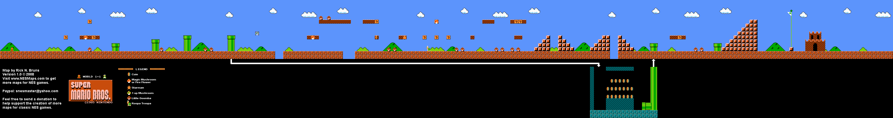
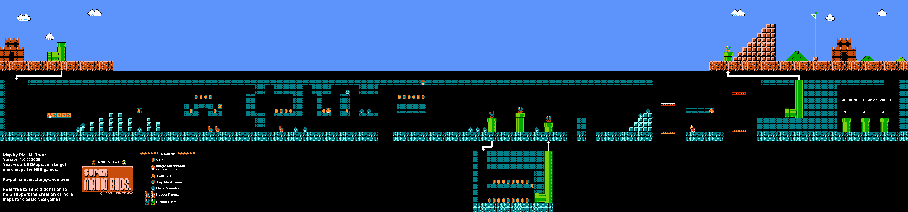
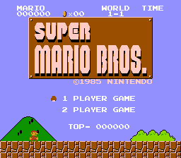
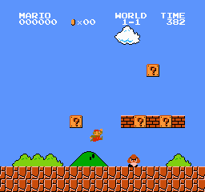

# Clover × Super Mario Bros.

用 [Clover 客户端引擎](https://github.com/qw576483/clover-client-unity-engine) **1:1 复刻《超级马里奥兄弟》**（Super Mario Bros.，NES）的工程。

**复刻范围**：World **1-1 / 1-2** 原版级还原，含 1-2 → 1-1 的秘密金币房通道；照原版做，不加不减。

## 原版对照画面

> 以上为**原版 NES 画面**，作为复刻的逐格对照基准（`策划/基线图/`）。
> 本工程的实机取证截图是**一次性产物**，验收后已按约定清理，不随仓库保存。

## 怎么玩

1. Unity **6000.x** 打开 `client/`；
2. 进 Play 即可（标题屏 → 按空格/回车开始）；
3. 引擎包 `com.clover.unity-engine` 由 UPM 自动从 [clover-client-unity-engine](https://github.com/qw576483/clover-client-unity-engine) 拉取（首次打开联网克隆，之后走本地缓存）—— **需本机已装 Git 且在 `PATH` 里**。

## 工程结构

| 路径 | 内容 |
|---|---|
| `client/` | Unity 工程（复刻本体；`Library/` `Temp/` `Logs/` 等生成物不入库） |
| `策划/` | 复刻规格（`策划案/SuperMarioBros参考规格.md`）、对照表、验收表、原版基线图 |
| `tools/` | 工具与探针：`verify.ps1`（一次性跑全部判据）、`visual-diff.py`（与基线图做像素级比对）、`probes/`（场景探针与测量脚本） |
| `docs/` | 任务书 |

## 声明

本项目**仅供技术交流与学习**，禁止用于任何商业用途。

## 相关仓库

| 仓库 | 说明 |
|---|---|
| [clover-client-unity-engine](https://github.com/qw576483/clover-client-unity-engine) | 客户端引擎（本工程的运行底座） |
| [clover-doc](https://github.com/qw576483/clover-doc) | 框架文档 |
| [clover-tools](https://github.com/qw576483/clover-tools) | 打表工具、AI 交付 skill |
